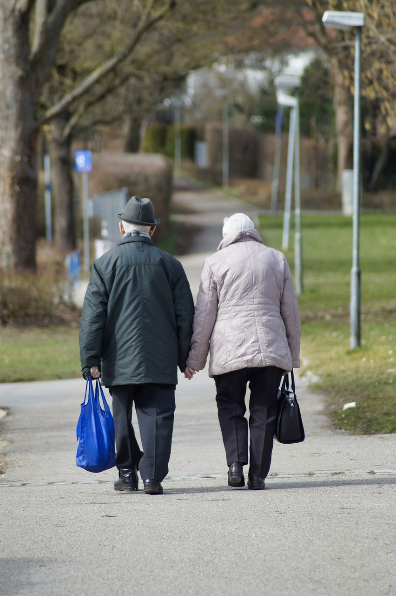
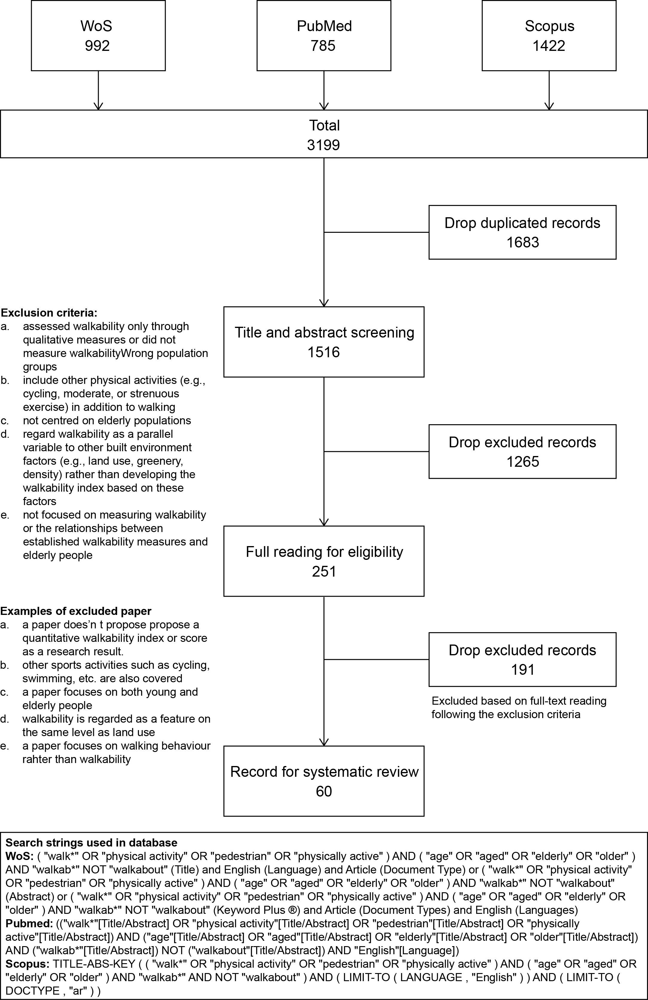
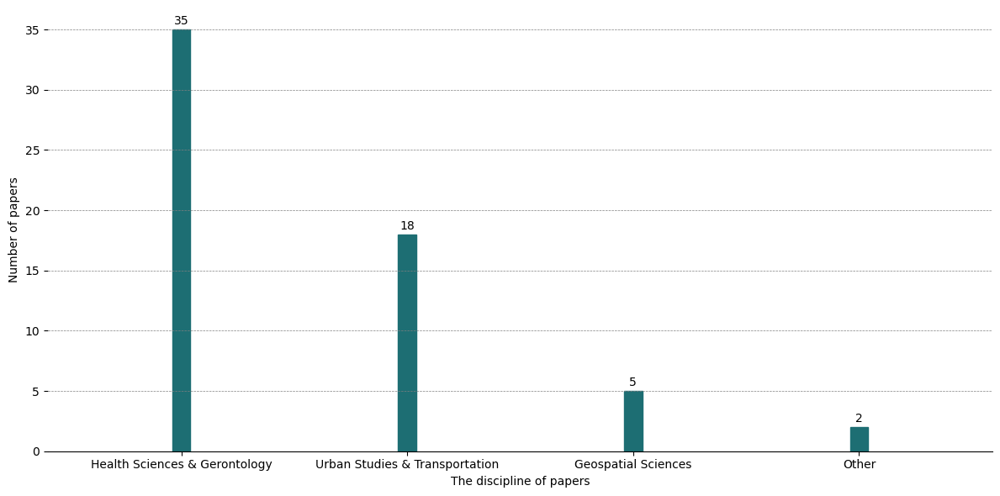
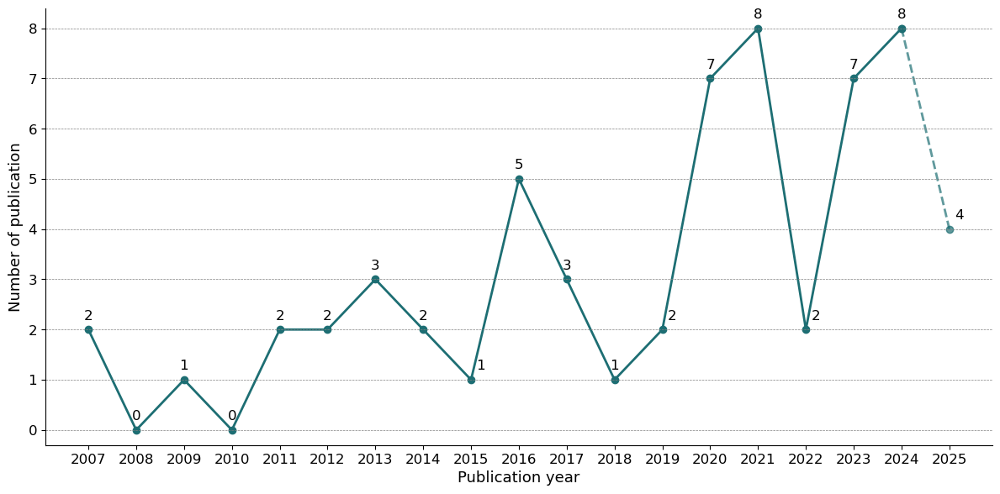
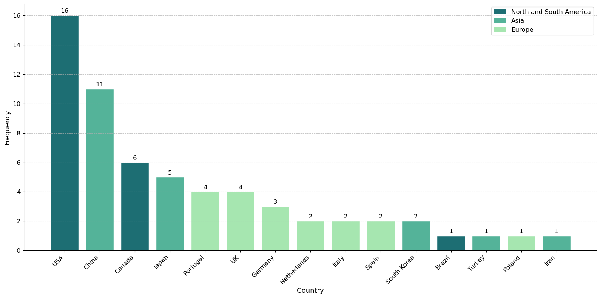
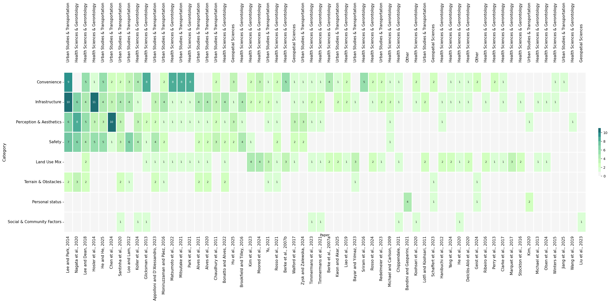
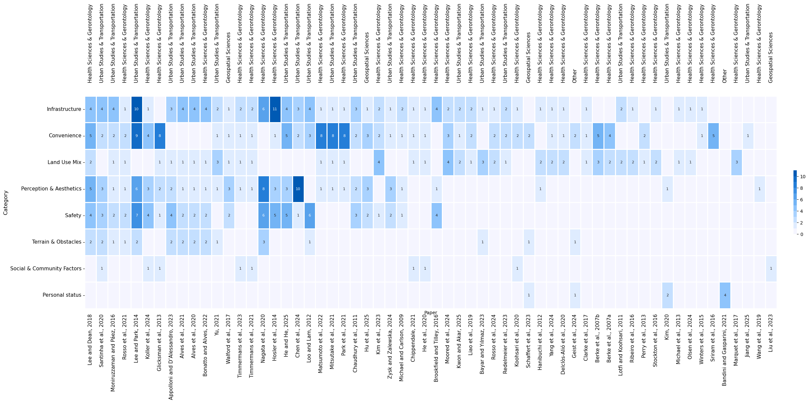
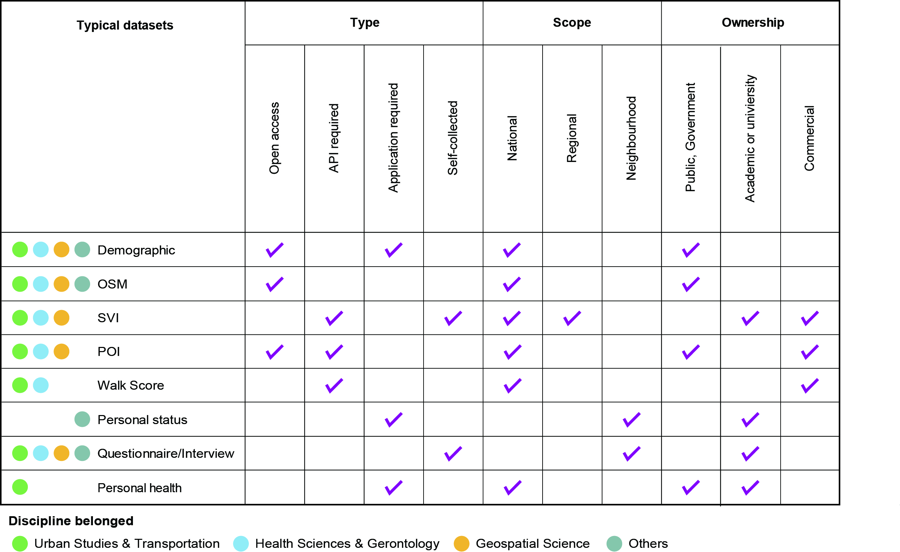

```{r xaringan-all,include=FALSE, echo=FALSE}
library(countdown)
library(xaringan)
library(xaringanExtra)
library(knitr)
library(xaringanthemer)

hook_source <- knitr::knit_hooks$get('source')
knitr::knit_hooks$set(source = function(x, options) {
  x <- stringr::str_replace(x, "^[[:blank:]]?([^*].+?)[[:blank:]]*#<<[[:blank:]]*$", "*\\1")
  hook_source(x, options)
})

xaringanExtra::use_broadcast()
xaringanExtra::use_freezeframe()
xaringanExtra::use_scribble()
#xaringanExtra::use_slide_tone()
xaringanExtra::use_search(show_icon = TRUE, auto_search	=FALSE)
xaringanExtra::use_freezeframe()
xaringanExtra::use_clipboard()
xaringanExtra::use_tile_view()
xaringanExtra::use_panelset()
xaringanExtra::use_editable(expires = 1)
xaringanExtra::use_fit_screen()
xaringanExtra::use_extra_styles(
  hover_code_line = TRUE,         
  mute_unhighlighted_code = TRUE  
)

```

class: center, middle
## Beyond words: Analysing the relationship between built environment and walking behaviour of elderly people using multimodal AI

[Zirui Guo](https://github.com/Gzrayyy)

**Supervisor**  
[Dr Mengdie Zhuang](https://www.sheffield.ac.uk/ijc/people/mengdie-zhuang) &
[Dr Suvodeep Mazumdar](https://www.sheffield.ac.uk/ijc/people/suvodeep-mazumdar) 

`r Sys.Date()`

---
```{r setup, include=FALSE}
options(htmltools.dir.version = FALSE)
knitr::opts_chunk$set(
  fig.width=9, fig.height=3.5, fig.retina=3,
  out.width = "100%",
  cache = FALSE,
  echo = TRUE,
  message = FALSE, 
  warning = FALSE,
  hiline = TRUE
)
```


```{r logo-global, echo=FALSE, results='asis'}
cat('
<script>
  window.addEventListener("DOMContentLoaded", function () {
    const slides = document.querySelectorAll(".remark-slide-content");

    slides.forEach(slide => {
      const logoWrapper = document.createElement("div");
      logoWrapper.className = "slide-logo";
      const img = document.createElement("img");
      img.src = "img/Primary logo.png";
      img.alt = "Logo";
      logoWrapper.appendChild(img);
      slide.appendChild(logoWrapper);
    });
  });
</script>

<style>
.slide-logo {
  position: absolute;
  top: 0em;
  right: 0em;
  width: 250px;
  z-index: 99;
}
.slide-logo img {
  width: 100%;
  height: auto;
}

/* 自动隐藏 inverse 页面上的 logo */
.remark-slide-content.inverse .slide-logo {
  display: none;
}
</style>
')
```


```{r xaringan-themer, include=FALSE, warning=FALSE}
library(xaringanthemer)
style_duo_accent(
  primary_color = "#1381B0",
  secondary_color = "#FF961C",
  inverse_header_color = "#FFFFFF"
)
```

```{r, load_refs, include=FALSE, cache=FALSE}
library(RefManageR)
BibOptions(check.entries = FALSE,
           bib.style = "authoryear",
           cite.style = "authoryear", 
           style = "markdown",
           hyperlink = TRUE,
           dashed = FALSE,
           max.names = 2,
           longnamesfirst = FALSE,
           no.print.fields=c("doi", "url", "urldate", "issn"))
myBib <- ReadBib("./mybib.bib", check = FALSE)
```

## Background
### Global aging challenge

According to `r Citet(myBib, 'unitednations_world_2025')`, the global population
aged 65 and above reached 771 million, nearly 10% of the world’s total, and is projected
to double the number of children under 5 and nearly equal those under 12 by 2050. In
England and Wales, this population grew by 20% between the 2011 and 2021 censuses, from
9.2 to 11 million `r Citep(myBib, 'officefornationalstatistics_profile_2023')`.

.pull-left[
```{r echo=FALSE, out.width='100%',fig.align='center'}
knitr::include_graphics('img/worldpop.png')
```
.small[Source: United Nation]]
---
## Background
### Elderly people and walking

These demographic shifts highlight the importance of encouraging elderly people to walk, 
which enhances life expectancy, health.
Moreover, evidence shows that the willingness to walk among
elderly people was significantly associated with the physical characteristics of streets `r Citep(myBib, 'joseph_where_2007')`, underscoring the need to study the built environment to encourage elderly people to walk.

In recent years, a great deal of research has been done on walkability, which is a key
metric for evaluating the built environment. Despite walkability is widely used, its measurement and the datasets vary widely.

---
## Literature Review
### The innovation of walkability

.pull-left[
"And third, the sidewalk must have users on it fairly continuously, both to add to the number of effective eyes on the street and to induce the people in buildings along the street to watch the sidewalks in sufficient numbers. Nobody enjoys sitting on a stoop or looking out a window at an empty street. Almost nobody does such a thing. Large numbers of people entertain themselves, off and on, by watching street activity." `r Citet (myBib, 'jacobs_death_1961')`
]


.pull-right[
```{r echo=FALSE, out.width='100%', fig.align='center'}
knitr::include_graphics('img/Jane_Jacobs.jpg')
```

.small[Jane Jacobs. Source: [Wikipedia](https://en.wikipedia.org/wiki/Jane_Jacobs)]
]

.footnote[*The Death and Life of Great American Cities*]

---

## Literature Review

### The innovation of walkability
- `r Citet (myBib, "gehl_life_1987")` proposed tripartite criteria of protection, comfort, and enjoyment, emphasising perception and spatial details in the walking experience.

- `r Citet (myBib, "appleyard_livable_1980")` proposed the concept of ‘liveable streets’ via empirical research, highlighting the impact of transportation on the quality of community life.

- `r Citet (myBib, "frank_impacts_1994")` was the first to empirically quantify the impact of land use mix and density on walking, laying the methodological groundwork for subsequent efforts to develop standardised metrics for assessing pedestrian-friendly environments.

- `r Citet (myBib, "cervero_travel_1997")` proposed a "3D" model (Density, Diversity, Design) to systematically frame the relationship between built environment and walking behaviour.

---
## Literature Review

### Built Environment-focused Definitions

- Neighbourhood walkability reflects the degree to which **neighbourhoods are conducive to walking activity**
`r Citep (myBib, "timmermans_associations_2021", .opts = list(max.names = 1))`

### Perception-based Definitions
- The term walkability refers to those **design elements** that guarantee the **accessibility**, **comfort**, and **safety** of the urban setting for walking
`r Citep (myBib, "bandini_social_2021")`

### Operational / Framework-based Definitions (used to measure walkability)
- 5D framework: **Density**, **Diversity**, **Design**, **Destination Accessibility**, and **Distance to Transit** `r Citep (myBib, "ewing_travel_2010")`

---
## Literature Review

### Walking for elderly people

.pull-left[
- Low-risk
- Sociable
- Reduce the risk of chronic diseases
- Alleviate elderly people’s negative emotions
]

.pull-right[
```{r echo=FALSE, out.width='75%', fig.align='center'}

```

.small[Source: [NHS](https://www.birminghamsolihull.icb.nhs.uk/news-and-events/news/recognition-awards-birmingham-and-solihull-initiatives-driving-improvements-culture-and-quality-across-nhs)]
]
---
## Literature Review

### Current systematic literature review on walkability
Despite the well-documented benefits of walking for older adults, few systematic reviews have specifically focused on this demographic. `r Citet (myBib, "edwards_examining_2018")` examined walking behaviours in elderly people but focused primarily on stair use rather than broader outdoor built environment features. 
`r Citet (myBib, "akinci_how_2022")`, on the other hand, compared how walkability has been measured for elderly people versus the general population but did not centre their review on elderly people themselves. 

Thus, there is a need for a systematic literature review on elderly people.

---
## Literature Review

### Walkability measurement
- On-site field study
  - Interview and questionnaire
  - Field audit
  
- GIS data based
  - POI, Land use, Street connectivity
  
- SVI
  - Visual audit
  - AI and Computer version
---
class: inverse middle

.center[
# Research questions
]

---
class: inverse middle
.center[
# Research questions
]
- What is the current state of research on walkability for elderly people?

---
## Methodology detail (Study 1)

.pull-left[
Search strings: 

( **"walk\*"** OR **"physical activity"** OR **"pedestrian"** OR **"physically active"** ) AND ( **"age"** OR **"aged"** OR **"elderly"** OR **"older"** ) AND **"walkab\*"** NOT **"walkabout"**

.small[.footnote[*Flowchart of PRISMA*]]
]

.pull-right[
```{r echo=FALSE, out.width='90%', fig.align='center'}

```

]
---
class: inverse middle
.center[
# Result of Study One
]


---
### Disciplines distribution
```{r echo=FALSE, out.width='100%', fig.align='center'}

```

The majority of publications belong to health science & gerontology, followed by urban studies & transportation and geospatial science.

.pull-left[.small[
.footnote[
*Discipline distribution of included papers*
]]]
---
### Annual publication of included papers
```{r echo=FALSE, out.width='100%', fig.align='center'}

```

The number of publication experience a growth with fluctuation, and is expected to reach a new peak by 2025.

.pull-left[.small[
.footnote[
*Annual publication of included papers*
]]]

---
### The geographic distribution of publication
```{r echo=FALSE, out.width='100%', fig.align='center'}

```

Imbalanced geographic distribution, with the majority of studies concentrated in developed countries.

.pull-left[.small[
.footnote[
*Geographic distribution of included papers*
]]]

---
### Demographic datail
- Majority of studies (n = 28, 47%) defined elderly as 65+, consistent with `r Citet(myBib, 'unitednations_world_2025')` definition; 
12 studies adopted a broader threshold of 60+.

- A smaller subset of studies employed more detailed stratification, such as classifying them into different age bands (e.g., aged 60
to 74, 75 to 89, and over 90), aimed to understand how the specific needs of each group affect
their mobility and walkability in urban public spaces.

- A few focused on specific subgroups, such elderly people with different mobility `r Citep (myBib, "chen_study_2024")`.

---
### Walkability definition

- Only 14 out of 60 studies (23%) explicitly mentioned walkability, while the remaining 77% used the concept without a formal definition.

- *Health Science & Gerontology* studies (n = 9) emphasized walkability as supportive environments for safe, comfortable, and active walking.

- *Urban Studies & Transportation*, and *Geospatial Science* papers defined walkability in terms of built environment “friendliness,” accessibility, or design features like density and diversity.


---
### Features and subcategories used for walkability
<div style="transform: scale(0.45);
            transform-origin: top left;
            width: 1600px; 
            height: 1200px;
            overflow: hidden;
            margin: 0 auto;">
  
  <iframe src="img/sunburst_plot.html"
          width="1600"
          height="1200"
          frameborder="0"
          style="border: 1px solid #ccc; border-radius: 6px;">
  </iframe>
</div>

.pull-left[.small[
.footnote[
*Sunburst of walkability features*
]]]

---
### Heatmap of walkability features


```{r echo=FALSE, out.width='120%', fig.align='center'}

```

Six studies (10%) employed more than 15 features, indicating highly comprehensive operationalisation, 22 studies (37%) used fewer than five features (such as sky proportion, land use, etc.).

.pull-left[.small[
.footnote[
*Heatmap of studies sorted by the number of walkability features used*
]]]
---
### Heatmap of walkability features

```{r echo=FALSE, out.width='120%', fig.align='center'}

```

Four studies (7%) used six or more subcategories, representing a highly multidimensional operationalisation.
Conversely, 16 studies (27%) used features from only one or two subcategories, indicating a more narrowly focused approach. 

.pull-left[.small[
.footnote[
*Heatmap of studies sorted by the number of walkability subcategories used*
]]]
---
### Details of typical datasets

```{r echo=FALSE, out.width='100%', fig.align='center'}

```

.pull-left[.small[
.footnote[
*Details of typical datasets*
]]]

---
### Methodology used

- Papers from Urban Studies & Transportation, Geospatial Science, and Others typically aimed to propose new measurements to calculate walkability.

- Studies from Health Science & Gerontology typically preferred using existing methods to calculate walkability, such as Walk Score.


---
### Discussion and Conclusion

- Oversimplified demographics: Broad age groups (60+/65+), no mobility stratification

- Narrow methodology: Focus on macro-scale features, missing micro-scale factors

- Missing elderly-specific frameworks: Current definitions ignore older adults' unique needs

- Static approach: Neglects dynamic factors (weather, temperature, walking purpose, and time)


---
class: inverse middle
.center[
# Research questions
]
- What is the current state of research on walkability for elderly people?
- How do different walkability index models perform in capturing elderly-specific needs, and which is the most suitable for this group under various scenarios?
- How can the inclusion of contextual features improve walkability assessments for elderly people, and what are the spatial distribution patterns and key influencing factors of the resulting dynamic walkability index?
- Is there a difference between elderly people and experts in their evaluation of walkability from elderly people perspective? (Optional)

---
## Methodology framework

<iframe width="768" height="432" src="https://miro.com/app/live-embed/uXjVIPrqKFc=/?embedMode=view_only_without_ui&moveToViewport=-24505,-6021,15946,10181&embedId=618613882657" frameborder="0" scrolling="no" allow="fullscreen; clipboard-read; clipboard-write" allowfullscreen></iframe>

---
## Potential contribution
- Identify the research gap of walkability for elderly people

- Identify contextual factors for elderly people is important

- Quantify contextual factors on walkability for elderly people

- Reveal expert-elderly walkability perception disconnect

---

## Reference

```{r results='asis', echo=FALSE}
PrintBibliography(myBib, start = 1, end = 5)
```

---
## Reference

```{r results='asis', echo=FALSE}
PrintBibliography(myBib, start = 6, end = 12)
```

---
## Reference

```{r results='asis', echo=FALSE}
PrintBibliography(myBib, start = 13, end = 20)
```

---
class: center, middle

# Thanks!

